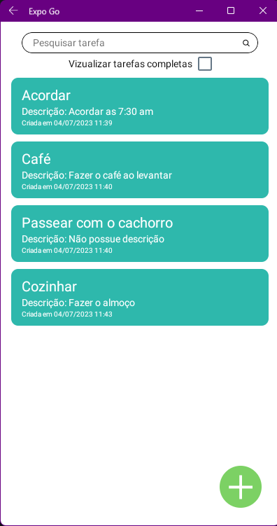
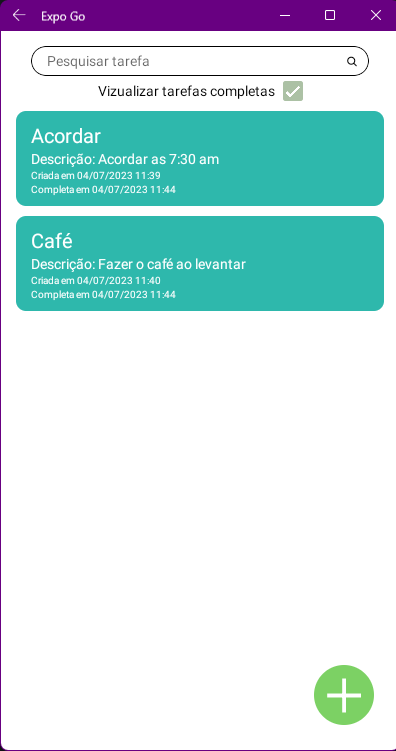
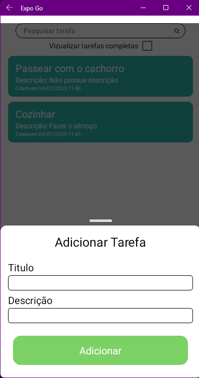
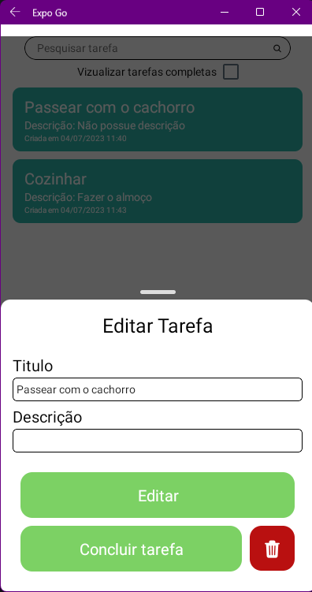
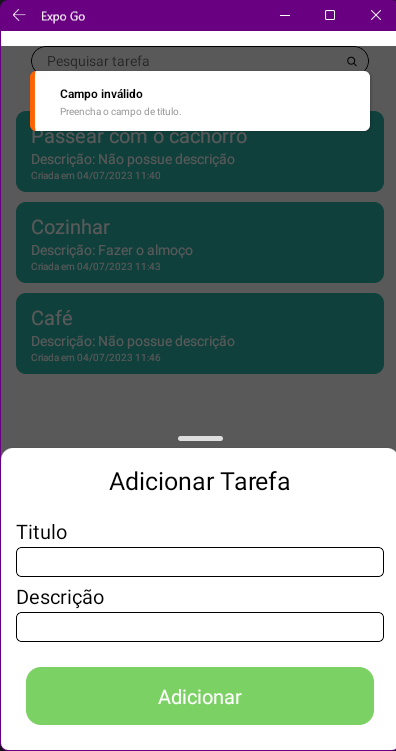
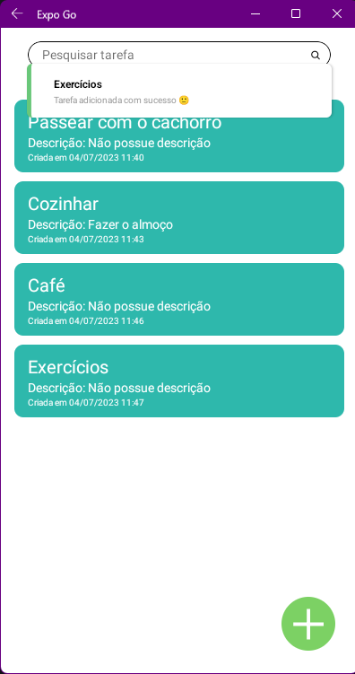
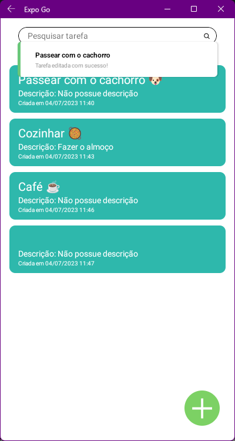
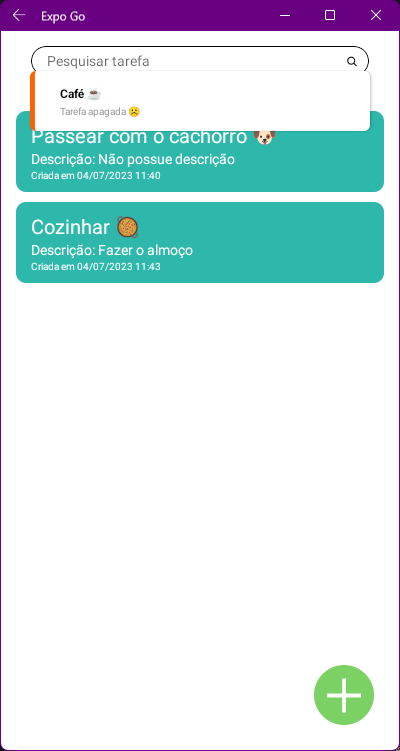
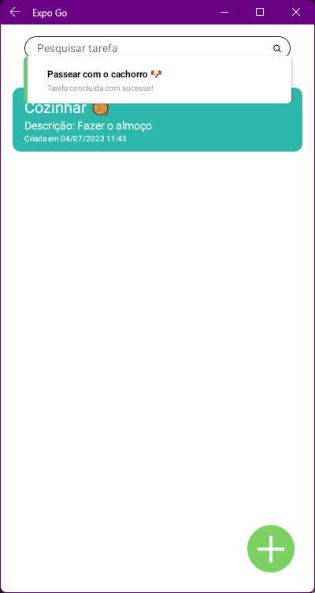

<h1 align="center"> TaskList 📋</h1>

  
  

# Índices 🗂
* [Sobre](#sobre-)
* [Screenshots](#screenshots-)
* [Screenshots Toast](#screenshots-toast-)
* [Links](#links-)

# Sobre ☄
Aplicativo de lista de tarefas feito com React Native e TypeScript.

# Screenshots 📸

    
    
    
    

# Screenshots Toast 📸

    
    
    
    
    

# Links 🔗

* Tost Lib: [Documentação](https://www.npmjs.com/package/react-native-toast-message)

Criado por [Iago Amorim](https://github.com/danonep2).

